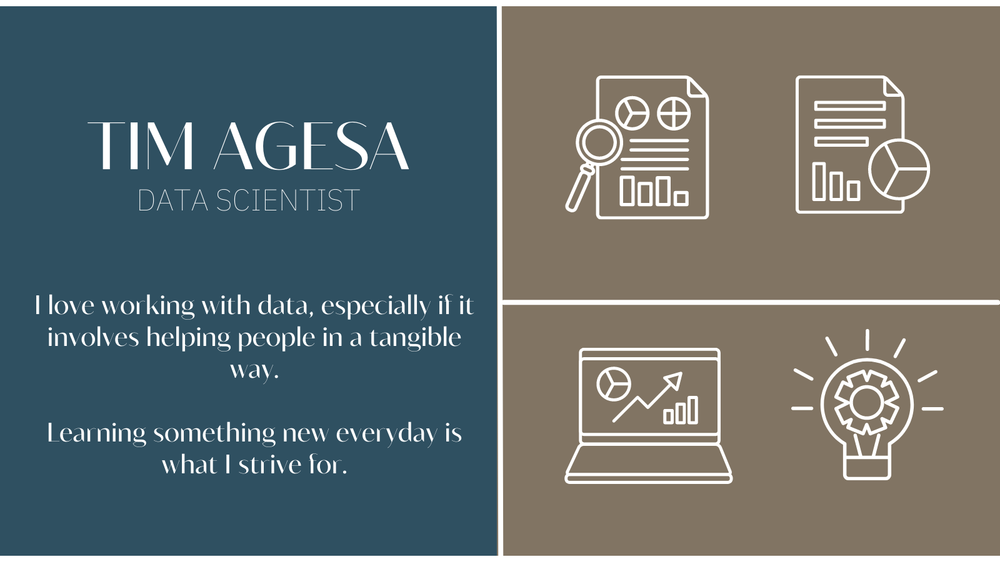

# 
Hello, Friends 

  
## &#128736;  Technologies & Tools I Use.  

- 

- 
  
- 

- 
  
- 
  
- 
  
- 

## &#128736;  Inspiration.

Here are some ideas to get you started:

- 🔭 I’m currently working on ...
- 🌱 I’m currently learning ...
- 👯 I’m looking to collaborate on ...
- 🤔 I’m looking for help with ...
- 💬 Ask me about ...
- 📫 How to reach me: ...
- 😄 Pronouns: ...
- ⚡ Fun fact: ...
-->

## &#x1f4c8; GitHub Stats

    
