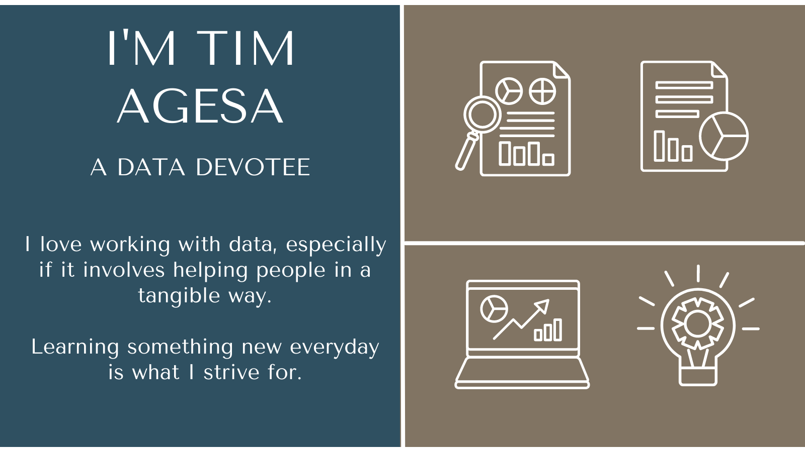

# 
Hello, Friends 

  
## &#128736;  Technologies & Tools I Use.  

- 

- 
  
- 

- 
  
- 
  
- 
  
- 
  

## &#128736;  Technologies & Tools I Use.

- 🌱 I’m currently learning data science
- 👯 I’m looking to collaborate on some cool data science projects
- 🤔 I’m looking for help with ...
- ⚡ Fun fact: ... I love playing chess, you can find me as papa_piethegieth at chess.com. Don't ask about the username 😄.

## &#x1f4c8; GitHub Stats

</a>  

## 	&#128161;  Inspiration.
This was greatly inspired by __Martin Heinz__:
- Article [here](https://towardsdatascience.com/build-a-stunning-readme-for-your-github-profile-9b80434fe5d7)
